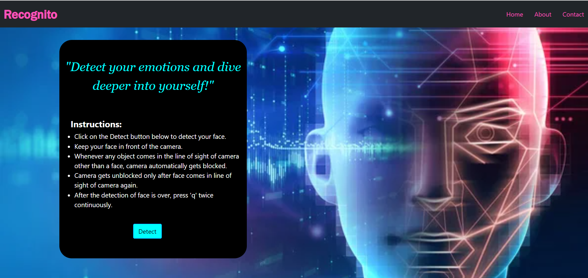
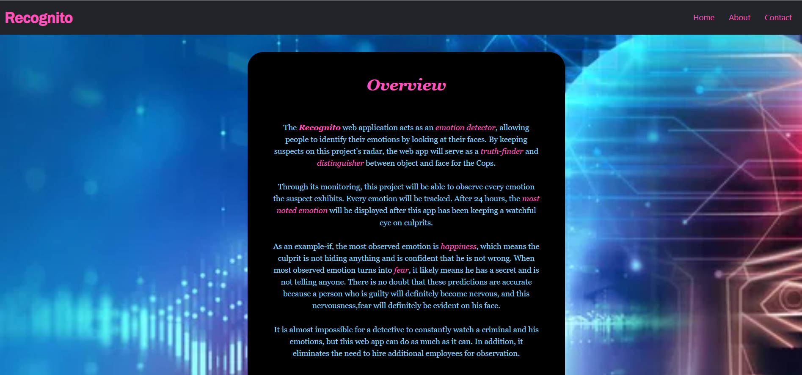
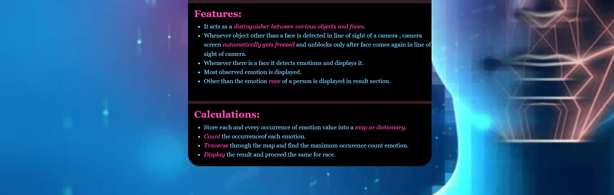
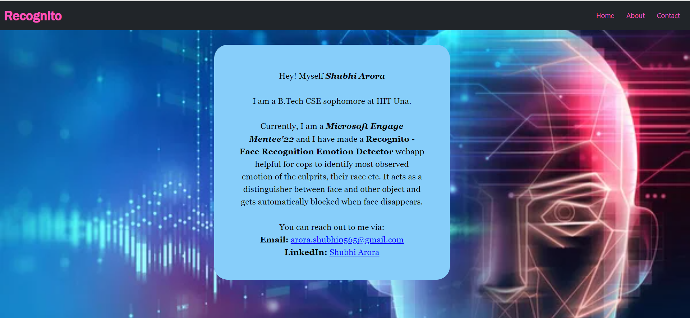

# Recognito
## Description
The **Recognito** web application acts as an **emotion detector**, 
allowing people to identify their emotions by looking at their faces.
               By keeping suspects on this project's radar, the web app will serve 
               as a **truth-finder** and **distinguisher between an object and a face** for the cops. 
                
                Through its monitoring, this project
                will be able to see every emotion the suspect exhibits. Every 
                emotion will be tracked. After 24 hours, the **most noted emotion** 
                will be displayed after this app has been keeping a watchful eye 
                on culprits.  
                As an example-if, the most observed emotion is 
                **happiness**, which means the culprit is not hiding anything and 
                is confident that he is not wrong. When most observed emotion 
                turns into **fear**, it likely means he has a secret and is not 
                telling anyone. There is no doubt that these predictions are 
                accurate because a person who is guilty will definitely become 
                nervous, and this nervousness,fear will definitely be evident on 
                his face. 
                 It is almost impossible for a detective to constantly watch a 
                criminal and his emotions, but this web app can do as much as it 
                can. In addition, it eliminates the need to hire additional employees
                 for observation. 
## Features
1. It acts as a **distinguisher** between various objects and faces
2. Whenever **object other than a face** is detected in line of sight of a camera, camera screen **automatically gets freezed** and unblocks only after face comes again in line of sight of camera.
3. Whenever there is a face it **detects emotions** and displays it.
4. Most observed emotion is displayed.
5. Other than the emotion of a person, **race** is also displayed in result section.

## Installation steps
**Note:** All the steps mentioned below are for **Windows** Operating System and uses latest version of **Python: 3.10.4**
1. Clone this Repo using git clone <a href="https://github.com/shubhi-arora/face-recognition.git">https://github.com/shubhi-arora/face-recognition.git<a>
2. Go to the directory where the project is cloned and then to face-recognition folder.
3. Open the project folder using **Visual Studio Code**.
4. Make sure latest version of Python setup is already installed in your computer. If not, then download and install it from <a href="https://www.python.org/downloads/">here</a> for Windows.
5. Open the terminal and run following commands to import libraries and install various packages.
  <ul>
<li>pip install opencv-python</li>
<li>pip install cv</li>
<li>pip install Flask</li>
<li>pip install matplotlib</li>
<li>pip install numpy</li>
<li>pip install DeepFace</li>
<li>pip install Counter</li>
  </ul>
  
  
6. Open the **app.py** file as initiation of project will be done through it. 
7. Open the **terminal** and run:  py -u path_of_app.py_file  If this command doesn't works then try writing:  python -u path_of_app.py_file 
 
OR
 
Run the app.py file in terminal directly.
   
  
  
8. Click on the local host link of port 5001 received in the terminal.

## Steps To Use
1. Click on the Detect button as shown on the homepage.
2. Keep your face in line of sight of camera.
3. As soon as the face gets away from camera and other object appears, camera screen gets blocked automatically.
4. It gets unblock only when face comes again in front of a camera.
5. As per the face emotions, emotions will be displayed of a person.
6. After pressing 'q' twice on the keyboard continuously camera stops and result of most observed emotion and race is displayed.

## Demo
**Homepage**
   

   
**About**
   

   
**Features and Calculations/Algorithm**
   
 
   
**Contact Info**
  
  
## Calculations/Algorithm
  1. Store each and every occurrence of emotion value into a **map or dictionary**.
  2. **Count** the occurrence of each emotion. 
  3. **Traverse** through the map and find the maximum occurence count emotion.
  4. **Display** the result and proceed the same for race.
## Tech-Stack Used
<ul>
<li>Python</li>
<li>OpenCV Library</li>
<li>Flask</li>
<li>HTML</li>
<li>CSS</li>
<li>Jupyter Notebook</li>
</ul>
  
  
## Future Scope
  1. Recognito can be taken to the **METAVERSE** in a way such that culprits in a cell will feel that Cops are there in front of them in the jail and so culprits will be forced to sit in front of the camera of this Recognito software, and this will ensure that culprits do not act over-smarter and not play any bad tactics . But in reality, no cops will be there around the culprits. Therefore, it is possible through **metaverse** to make policemen available in front of culprits without actually having them in reality.
  2. More advancements can be made in this project in the near future such as it can detect face color, hair color, face shape etc.
  3. Other than this, it can have the capability to detect any unwanted dangerous equipment hided inside the culprits body.
  
## Connect with me:
  
   
   
   

